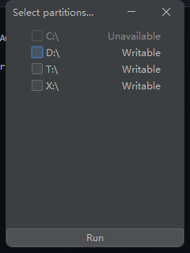
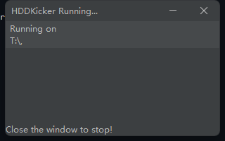

# HardDiskDriveKicker
The Java version of HDD_Awaker(https://github.com/Sodacooky/HDD_Awaker)
# Features
* Scan all partitions on your computer, windows or linux or other jvm-ready systems available.
* Easy to use interface.
# Shortage
* Base on Java, need JVM environment.
* Unnecessary memory usage. (1,000% higher than C++ version)
# Screenshot

